# 🌟 Cultural Heritage Story Teller

<div align="center">


**An intelligent AI system that "sees" cultural artifacts and weaves authentic stories about India's rich heritage**

[🚀 Quick Start](#-quick-start) • [📊 Features](#-what-makes-this-special) • [🏗️ Architecture](#️-3-stage-progressive-architecture) • [🤝 Contributing](#-contributing) • [📜 License](#-license)

</div>

---

## 🎯 Overview

This project fine-tunes a **Qwen2-VL (2B parameters)** vision-language model using a **3-stage progressive learning approach** on **1,360 diverse regional images** spanning India's vast cultural tapestry. Transform silent cultural images into vivid, contextual narratives for digital heritage preservation.

## ✨ What Makes This Special?

- 🎯 **Revolutionary 3-Stage Training**: Recognition → Understanding → Storytelling  
- 🗺️ **Pan-Indian Coverage**: 5 geographical regions (North, South, East, West, Northeast)  
- 🚀 **Advanced LoRA Fine-tuning**: 85% performance improvement achieved  
- 📖 **Authentic Narratives**: Culturally accurate stories preserving heritage  
- 💡 **Research Innovation**: Novel progressive learning methodology  

## 🏛️ Cultural Impact

> *Transforming silent cultural images into vivid, contextual narratives for digital heritage preservation.*

This project addresses the critical need for digital cultural preservation by:

- 📚 **Documenting Stories**: Converting visual heritage into textual narratives  
- 🌍 **Accessibility**: Making cultural knowledge accessible globally  
- 🔬 **Research Tool**: Supporting cultural studies and heritage research  
- 🎓 **Education**: Enhancing cultural education through AI storytelling  

## 📊 Project Highlights

<div align="center">

| Metric | Achievement |
|--------|-------------|
| 📷 Dataset Size | 1,360 curated cultural images |
| 🧠 Model Parameters | 2B (Qwen2-VL) with LoRA fine-tuning |
| 📈 Performance Improvement | 85% loss reduction (130 → 19.7) |
| 🗺️ Regional Coverage | 5 major Indian geographical regions |
| 🏗️ Training Methodology | 3-stage progressive learning |
| ✅ Cultural Accuracy | High-quality, authentic narratives |

</div>

## 🏗️ 3-Stage Progressive Architecture

```mermaid
graph TD
    A[Cultural Image Input] --> B[👁️ Qwen2-VL Vision Encoder]
    B --> C[🧠 Language Model Processing]
    C --> D[Stage 1: Element Recognition]
    D --> E[Stage 2: Pattern Understanding]
    E --> F[Stage 3: Story Generation]
    F --> G[📖 Cultural Story Output]
    
    D -.-> H[Identifies cultural elements]
    E -.-> I[Understands regional context]
    F -.-> J[Weaves authentic narratives]
```



### 🔍 Stage 1 — Cultural Element Recognition  
- Identifies temples, sculptures, architectural features  
- Recognizes traditional clothing, artifacts, decorations  
- **Training:** 1 epoch, LR: `2e-4`

### 🎨 Stage 2 — Cultural Pattern Understanding  
- Understands architectural styles (Dravidian, Mughal, etc.)  
- Analyzes regional patterns and significance  
- **Training:** 1 epoch, LR: `1e-4`

### 📚 Stage 3 — Cultural Story Generation  
- Generates authentic, contextual narratives  
- Preserves cultural accuracy and historical context  
- **Training:** 2 epochs, LR: `5e-5`

## 🚀 Quick Start

### Installation

```bash
# Clone the repository
git clone https://github.com/PranavSingla122/Cultural-Heritage-Story-Teller.git
cd Cultural-Heritage-Story-Teller

# Install dependencies
pip install -r requirements.txt

# Install additional requirements for vision-language models
pip install transformers[vision] torch torchvision peft accelerate bitsandbytes
```

### Basic Usage

```python
from inference import CulturalStoryTeller

# Initialize the model
storyteller = CulturalStoryTeller("./models/cultural_vlm_trained")

# Generate story from cultural image
image_path = "examples/temple_image.jpg"
story = storyteller.generate_story(image_path)
print(story)
```

### Example Output

```
This authentic East India scene while reveals a group of people walking across a bridge. The distinctive colonial calcutta showcases the region's unique architectural heritage and Regional cultural elements including poila boishakh, adda culture provide authentic local context. People adorned in traditional dress, ethnic wear embody the living culture....
```

## 📁 Repository Structure

```
Cultural-Heritage-Story-Teller/
├── 🐍 train_progressive.py       # Main 3-stage training pipeline
├── 🔧 continue_training.py       # Optional optimization script
├── 🔮 inference.py               # Story generation from trained model
├── 📊 dataset_utils.py           # Dataset loading and preprocessing
├── 🎛️ config.py                  # Training configuration
├── 📋 requirements.txt           # Python dependencies
├── 📁 data/                      # Dataset directory
│   └── cultural_dataset.json     # Your cultural image dataset
├── 📁 models/                    # Trained model checkpoints
│   └── cultural_vlm_trained/     # Final trained model
├── 📁 examples/                  # Usage examples and demos
└── 📖 README.md                  # This file
```

## 🎯 Training Your Own Model

### Dataset Format

Your cultural dataset should follow this JSON structure:

```json
{
  "image_path": "regional_images/South_India/temple_001.jpg",
  "region": "South_India",
  "real_features": {
    "detected_elements": ["temple", "gopuram", "sculpture"],
    "architecture": {"style": "Dravidian"},
    "colors": {"dominant": ["brown", "red"]},
    "scene": {"type": "religious"}
  },
  "unique_story": "This ancient Dravidian temple stands as a testament...",
  "cultural_context": "South Indian temple architecture represents..."
}
```

### 3-Stage Progressive Training

```bash
# Run complete 3-stage progressive training
python train_progressive.py

# For testing with limited samples
python train_progressive.py --test_samples 100

# Single stage training (skip progressive approach)
python train_progressive.py --single_stage
```


## 📈 Training Results

<div align="center">

| Stage | Task | Loss Reduction | Key Learning |
|-------|------|----------------|--------------|
| 1 | Element Recognition | 504 → 217 | Cultural artifact identification |
| 2 | Pattern Understanding | 217 → 201 | Regional style comprehension |
| 3 | Story Generation | 184 → 19.7 | Authentic narrative creation |

</div>

### Regional Dataset Distribution

<div align="center">

| Region | Samples | Coverage |
|--------|---------|----------|
| 🏔️ **North India** | 160 | Rajasthan, Delhi, Himalayas |
| 🏛️ **South India** | 400 | Tamil Nadu, Karnataka, Kerala |
| 🎭 **East India** | 400 | West Bengal, Odisha, Jharkhand |
| 🏜️ **West India** | 200 | Gujarat, Maharashtra, Rajasthan |
| 🌄 **Northeast India** | 200 | Assam, Meghalaya, Sikkim |

</div>

## 🛠️ Technical Specifications

### Model Architecture
- **Base Model**: Qwen2-VL-2B-Instruct
- **Fine-tuning**: LoRA (r=8, α=32, 7 target modules)
- **Quantization**: 4-bit with bfloat16 precision
- **Context Length**: 512 tokens
- **Image Resolution**: 336×336 pixels

### Training Configuration
- **Optimizer**: AdamW with cosine scheduling
- **Memory Optimization**: Gradient checkpointing + quantization
- **Hardware Requirements**: 8 GB+ GPU recommended
- **Training Time**: ~3–5 hours for full pipeline

## 🤝 Contributing

We welcome contributions from cultural enthusiasts, AI researchers, and heritage preservationists!

### How to Contribute

1. 🍴 **Fork** the repository
2. 🌿 **Create** a feature branch (`git checkout -b feature/amazing-feature`)
3. 💾 **Commit** your changes (`git commit -m 'Add some amazing feature'`)
4. 📤 **Push** to the branch (`git push origin feature/amazing-feature`)
5. 🔀 **Open** a Pull Request

### Contribution Areas

- 🎨 **Dataset Expansion**: Adding more regional cultural images
- 🔬 **Model Improvements**: Enhancing training methodologies
- 🌍 **Multilingual Support**: Adding regional language stories
- 📱 **Applications**: Building demo apps and interfaces
- 📖 **Documentation**: Improving guides and examples


## 📜 License

This project is licensed under the **Apache License 2.0** – see the [LICENSE](LICENSE) file for details.

<div align="center">

| Permission | Status |
|------------|--------|
| ✅ Commercial Use | Permitted |
| ✅ Modification | Permitted |
| ✅ Distribution | Permitted |
| ✅ Patent Use | Permitted |
| ⚠️ Trademark Use | Not permitted |

</div>

## 🙏 Acknowledgments

- Thanks to the Qwen team for the amazing vision-language model
- Open source community for continuous support and contributions

---

<div align="center">

**⭐ Star this repository if it helped preserve cultural heritage through AI!**

Story-Teller/issues) • [Discussions](https://github.com/PranavSingla122/Cultural-Heritage-Story-Teller/discussions)

</div>
